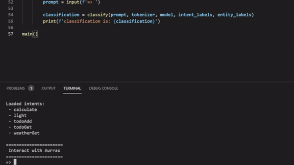

# Project Aurras
Project Aurras is a virtual assistant I am building using intent classification and entity extraction.  This project's goals are to
1. Be able to understand direct and contextual commands
2. Be able to hold natural conversation
3. Be able to interact with extral APIs (IE turning on lights)

## Currently Project Aurras has two components, with two more being developed.

### Intent Classification
Intent classification is how Aurras understands what you want her to do.  Intent classification is done by using the distilbert-base-uncased transformer and categorica classification on its output.  By analyzing sentences she classifies each prompt into a single intent.  Then, based on this intent, she can preform different actions.  See my article on [intent classification](https://medium.com/nerd-for-tech/building-a-personal-ai-assistant-part-2-afb26c2a3b5b) for a full guide on how she does it.

### Entity Extraction
Entity extraction is how Aurras picks up on information relating to your intents.  Entity extraction is done by using the distilbert-base-uncased transformer to classify individual tokens.  Whether it be understanding what colour to set your lights to, or when you want the weather for (I said saturday, not thursday you dimwit!). See my article on [Entity Extraction]() for a full guide on how she does it.

Components in development:

### Text-To-Speech
### Speech-To-Text

Planned components:

### GPT for conversational interactions

